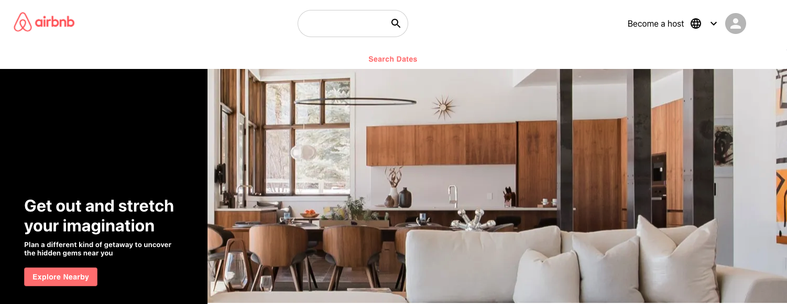

# react AIRBNB CLONE

A clone of the website Airbnb that features material ui icons, react router, date-picker, and firebase for hosting.

Final App deploy: https://airbnb-25cea.web.app

<h1>Header and Banner</h1>
  
   <h1>Date Picker</h1>
  
  <h1>Card Info</h1>
  
  <h1>Search Results Page 1</h1>
    
    <h1>Search Results Page 2</h1>
    
      <h1>Footer - This is a Demo</h1>
      

## Features

REACT

MATERIAL UI

REACT ROUTER

FIREBASE HOSTING

FLEXBOX

REACT DATE RANGE
